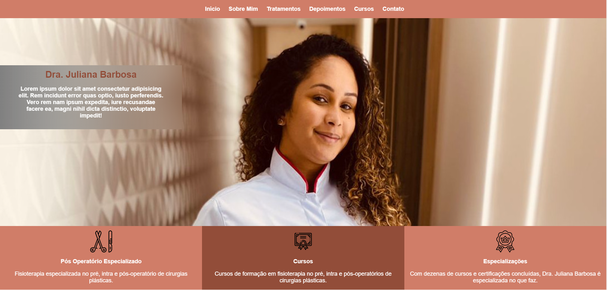
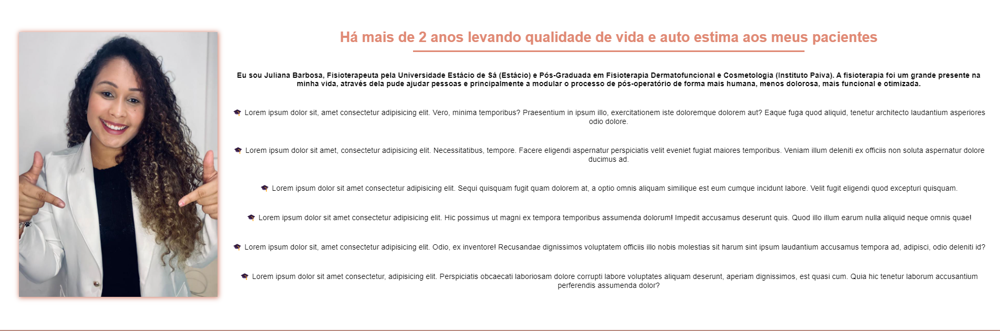
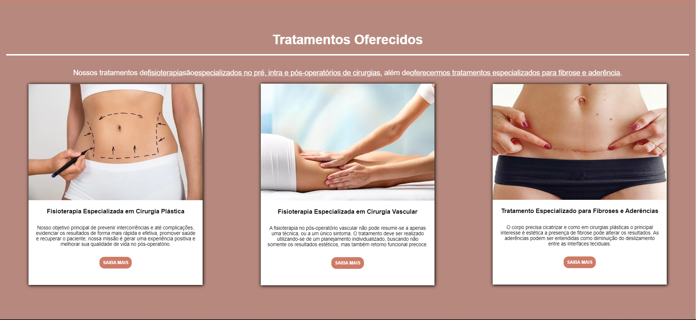
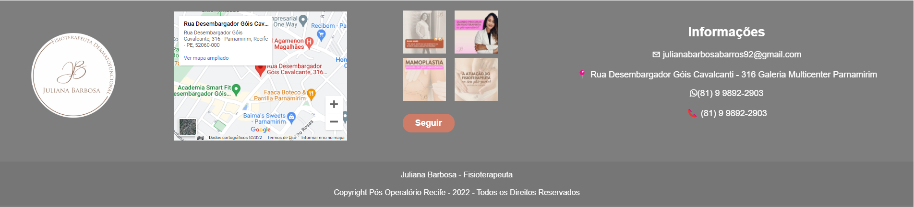

# Site Fisioterapeuta Juliana

Desenvolvi esse projeto como demonstração para uma fisioterapeuta, usar futuramente como um site próprio, tive como objetivo maior a estilização e aparência pois se trata, de um serviço de estética, meu maior desafio nesse projeto foi tentar colocar todo ele responsivo, mas ainda sim tive bastante dificuldade, coloquei um pouco de JavaScript para deixar o scroll automático ao clicar no link barra de menu no Header. Aprendi a usar a propriedade "Flexbox" alinhando os ítens ao lado, e a colocar e configurar uma imagem de fundo na página.

##

# Objetivo do Projeto

Meu maior objetivo nesse projeto, foi deixar um site bastante apresentável e com uma aparência muito atraente, busquei melhorar mais em relação a estilização, e pesquisei muito a respeito de responsividade, flexbox, flexgrid.

##

# Tecnologias

* JavaScript
* CSS
* HTML

##

# Gif e Imagens do Projeto

##

# Link para visualizar projeto em seu navegador.

Clique no link abaixo para ter uma experiência melhor visualizando o meu projeto em seu navegador.

https://rodrigobarros2802.github.io/fisiojuliana/
